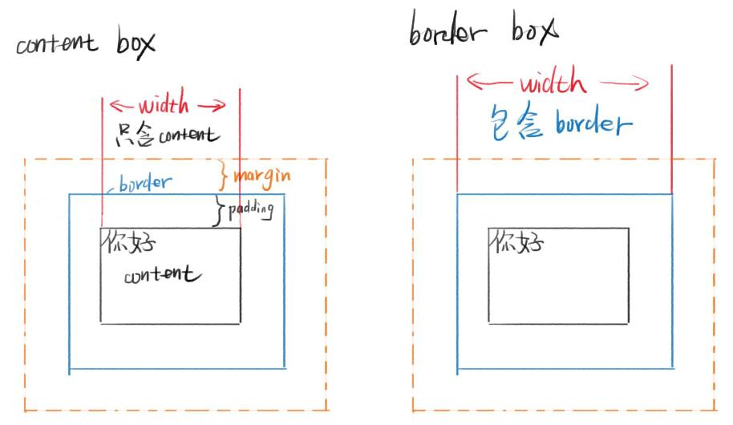
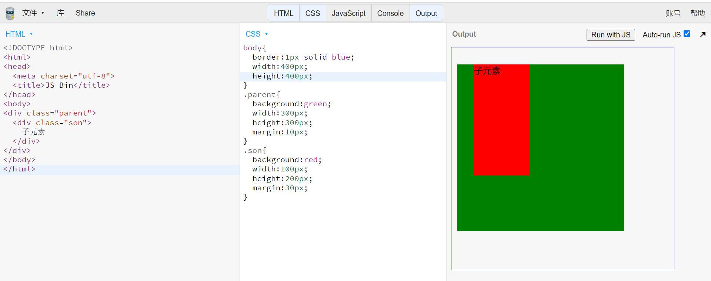
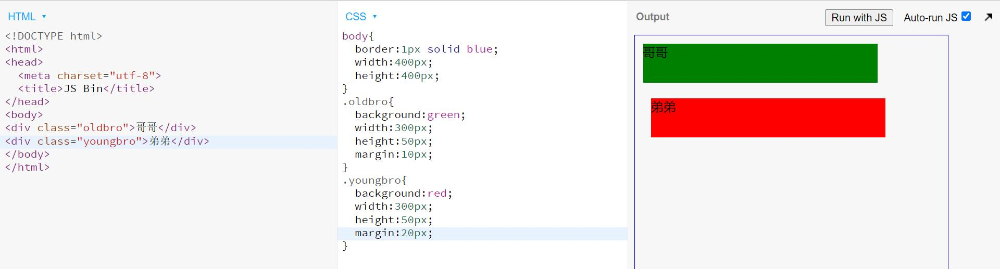

# 盒模型
## 是什么，包括什么
* CSS盒模型本质上是一个盒子，用来封装周围的HTML元素，又称框模型(Box Model)。
* 组成部分：外边距(margin)，边框(border)，内边距(padding)和实际内容(content)。
## 分类
  
* 分为内容盒模型(content box)和边框盒模型(border box)。区别只在于宽度计算方式，内容盒模型的宽度仅包含"content"模块，边框盒模型的宽度包含"content+padding+border"三个模块。一般我们采用边框盒模型，方便自己设置各个模块的宽度。
## margin合并
当两个垂直外边距相遇时，他们将形成一个外边距，合并后的外边距高度等于两个发生合并的外边距的高度中的较大者。

注意是垂直方向，不影响水平方向。
* 父子合并
  
  父元素的上边距与子元素的上边距重合。
  
  消除方法：border /  overflow:hidden / padding
  

* 兄弟合并

    兄弟元素的上边距和下边距重合。
    
    消除方法：display:inline-block
    